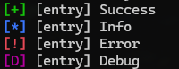

# Useful Scripts
Somewhere to store all of the random scripts I make in case they're useful in the future :)

*Note: I have developed these scripts on both Windows and Linux, so if a script is giving a strange error, try Dos2Unix.*

## Contents

- [crtsh_query.py](#crtsh_querypy)
- [debug.h](#debugh)
- [fnv1a_32.py](#fnv1a_32py)
- [hashing_test.c](#hashing_testc)
- [logger.py](#loggerpy)
- [nmap4appendix.py](#nmap4appendixpy)

### crtsh\_query.py

Queries crt.sh with a given query, parses and outputs unique domains.

**Usage**

```
crtsh_query.py [-h] query

Script to query crt.sh and pull unique domain names

positional arguments:
  query       query for crt.sh (e.g. google.com)

optional arguments:
  -h, --help  show this help message and exit
```

### debug.h

Debug header file I end up including in many projects, adds a set of logging functions that will only be included in debug mode (only tested with MSVC)

**Usage**

```c
#include "debug.h"

int main(int argc, char** argv, char** envp)
{
  LOG_SUCCESS("Success");
  LOG_INFO("Info");
  LOG_ERROR("Error");
  LOG_DEBUG("Debug");
  return 0;
}
```

**Example output**

 

### fnv1a\_32.py

Hashes a given list of strings with [FNV1a (32bit)](https://en.wikipedia.org/wiki/Fowler%E2%80%93Noll%E2%80%93Vo_hash_function), useful for builder scripts.

**Usage**

```
python .\fnv1a_32.py
```

**Example output**

```
python .\fnv1a_32.py
0x7794e6cc: USERNAME=
0x3edf40f2: COMPUTERNAME=
0x48623011: USERDOMAIN=
0xa1509af4: USERDNSDOMAIN=
```

### hashing\_test.c

Loads a given dll and hashes its exports with [FNV1a (32bit)](https://en.wikipedia.org/wiki/Fowler%E2%80%93Noll%E2%80%93Vo_hash_function).

**Usage**

```
hashing_test <dll>
```

**Example output**

```
.\hashing_test.exe ntdll.dll
0x467f5122 ntdll.dll
0x8979cbb4 A_SHAFinal
0x0cb8ab7e A_SHAInit
0x73cc0edd A_SHAUpdate
0x5dc343c5 AlpcAdjustCompletionListConcurrencyCount
0x88a0af25 AlpcFreeCompletionListMessage
0x20db6563 AlpcGetCompletionListLastMessageInformation
```

### logger.py

QoL class for printing your typical coloured `[+] Success!` logs.

**Usage**

```python
import logger


log = logger.Logger(debug=True)

log.success("Success")
log.info("Info")
log.debug("Debug")
log.error("Error")
```

**Example output**

 

### nmap4appendix.py

QoL tool of which wraps nmap to generate CSV output. Useful for generating tables in word via CSV.

**Usage**

```
nmap4appendix.py [-h] (-l LIST | -H HOSTS) [-o OUTFILE] [-u]

nmap scans given hosts, and outputs in report-friendly CSV

options:
  -h, --help            show this help message and exit
  -l LIST, --list LIST  file containing lists of hosts
  -H HOSTS, --hosts HOSTS
                        specify comma-seperated hosts via command line
  -o OUTFILE, --outfile OUTFILE
                        output filepath
  -u, --udp             Perform UDP scan (default: false)
```

**Example output**

```
[*] Executing: nmap -sC -sV -p- --min-rate=1000 -oX - 8.8.8.8
[+] Scan complete
[*] Parsing results
[+] Parsing complete
IP Address,Hostname,Port,Protocol,Service
8.8.8.8,dns.google,53,,
8.8.8.8,dns.google,443,https,
[+] Finished!
```